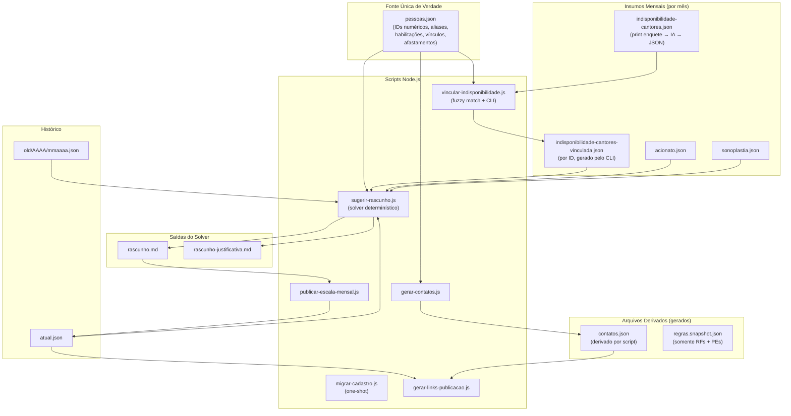
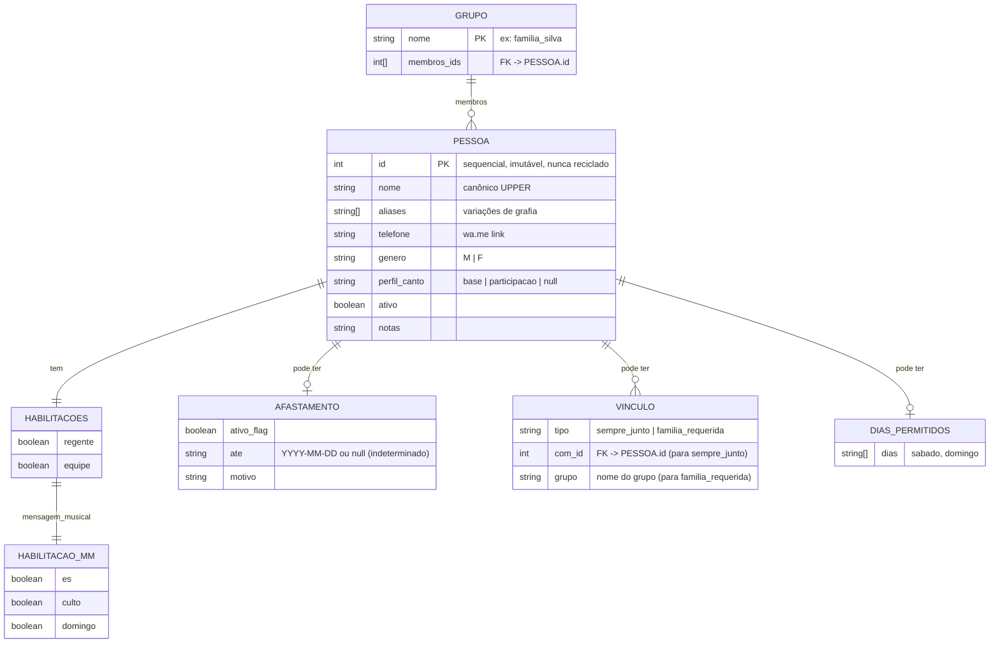
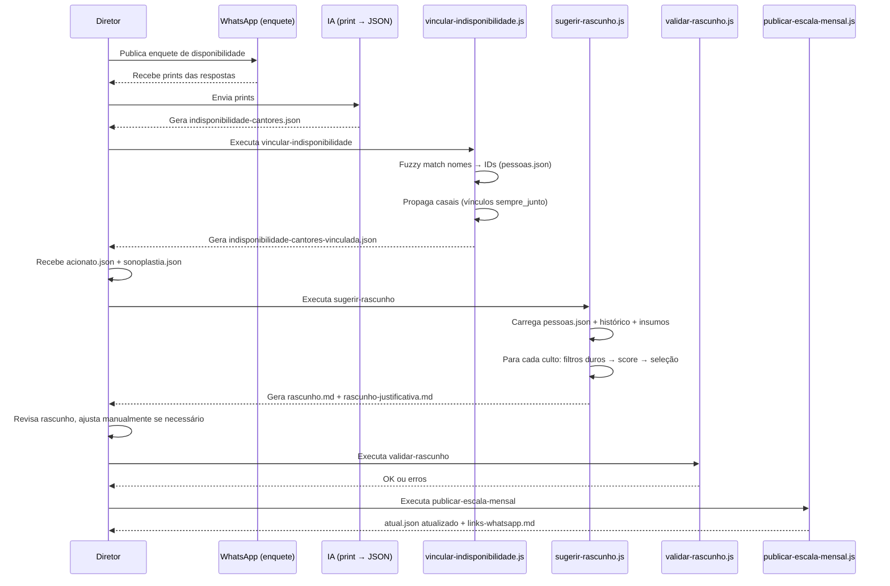

# Design Document: Cadastro Unificado e Solver

## Overview

Este documento descreve a refatoração do modelo de dados do EscalaMusica para unificar o cadastro de pessoas em um único arquivo (`pessoas.json`) com IDs numéricos imutáveis, migrar restrições pessoais (RPs) do `regras.snapshot.json` para atributos do cadastro, e implementar um solver determinístico que gera sugestões explicáveis (`rascunho.md` + `rascunho-justificativa.md`).

A motivação principal é eliminar a dispersão de dados (mesma pessoa em 3 arquivos), tornar as sugestões rastreáveis e reproduzíveis, e permitir que o ciclo mensal de montagem da escala seja mais automatizado e menos dependente de IA generativa para decisões que podem ser algorítmicas.

O sistema permanece como site estático sem backend — todos os scripts rodam em Node.js local, produzem JSON/Markdown, e o deploy continua via GitHub Pages.

## Architecture

### Diagrama de arquitetura pós-refatoração



### Modelo conceitual de dados



### Fluxo do ciclo mensal atualizado



### Estratégia de migração

1. **Script one-shot `scripts/migrar-cadastro.js`**:
   - Lê `processos/regras/cadastros/funcoes-louvor.json` + `contatos.json` + `regras.snapshot.json`
   - Atribui IDs sequenciais (1, 2, 3...) em ordem alfabética do nome canônico
   - Merge telefone de `contatos.json` (via match por nome/alias)
   - Migra RPs relevantes → campos `afastado`, `vinculos`, `dias_permitidos`, `perfil_canto`
   - Gera `pessoas.json` completo
   - Gera relatório de migração em stdout

2. **Limpeza do `regras.snapshot.json`**:
   - Remove seção `restricoes_pessoais` inteira
   - Mantém `regras_fundamentais`, `preferencias`, `papeis`, `glossario`, `features_futuras`

3. **Script `scripts/gerar-contatos.js`**:
   - Lê `pessoas.json`
   - Gera `contatos.json` derivado no formato atual (compatível com frontend + `gerar-links-publicacao.js`)

4. **Ordem de execução**:
   ```
   node scripts/migrar-cadastro.js          # gera pessoas.json
   node scripts/gerar-contatos.js           # regenera contatos.json derivado
   npm test                                  # valida que nada quebrou
   ```

5. **Retrocompatibilidade**:
   - `contatos.json` continua existindo com a mesma shape → frontend não quebra
   - `atual.json` e `old/*` não mudam formato
   - `publicar-escala-mensal.js` e `gerar-links-publicacao.js` continuam lendo `contatos.json`
   - `controle-rotacao-utils.js` será adaptado para ler `pessoas.json` diretamente

---

## Components and Interfaces

### Componente 1: Cadastro Unificado (`pessoas.json`)

**Propósito**: Fonte única de verdade para todas as pessoas do sistema — cantores, regentes, membros externos, departamentos.

### Componente 2: Vinculador de Indisponibilidade (`scripts/vincular-indisponibilidade.js`)

**Propósito**: Resolve nomes informais da enquete WhatsApp para IDs numéricos de `pessoas.json` via fuzzy match. Propaga indisponibilidade entre casais. Gera arquivo vinculado por ID.

### Componente 3: Solver de Sugestão (`scripts/sugerir-rascunho.js`)

**Propósito**: Gera sugestão determinística de escala mensal com justificativa por escolha. Aplica filtros duros (RFs, indisponibilidade, afastamento) e score composto para ranking.

### Componente 4: Gerador de Contatos (`scripts/gerar-contatos.js`)

**Propósito**: Deriva `contatos.json` a partir de `pessoas.json` para manter retrocompatibilidade com frontend e scripts de publicação.

### Componente 5: Migrador One-Shot (`scripts/migrar-cadastro.js`)

**Propósito**: Execução única que consolida os 3 arquivos atuais em `pessoas.json`.

---

## Data Models

### Schema completo: `pessoas.json`

```json
{
  "versao": "1.0.0",
  "proximo_id": 66,
  "ultima_atualizacao": "2026-07-10",
  "grupos": {
    "familia_silva": { "membros_ids": [2, 3, 4, 5] }
  },
  "departamentos_contato": {
    "AVENTUREIROS": { "representante_id": 2, "nota": "JESSIE é contato do departamento" },
    "JOVENS": { "representante_id": null, "nota": "sem representante fixo" }
  },
  "pessoas": [
    {
      "id": 1,
      "nome": "VONI",
      "aliases": ["VONIVALDO"],
      "telefone": "556984254032",
      "genero": "M",
      "ativo": true,
      "perfil_canto": "base",
      "notas": "Habilitado para equipe e Mens. Musical (ES e Domingo).",
      "habilitacoes": {
        "regente": false,
        "equipe": true,
        "mensagem_musical": { "es": true, "culto": false, "domingo": true }
      },
      "afastado": null,
      "vinculos": [],
      "dias_permitidos": null
    },
    {
      "id": 2,
      "nome": "JESSIE",
      "aliases": [],
      "telefone": "554399149664",
      "genero": "F",
      "ativo": true,
      "perfil_canto": "participacao",
      "notas": "Representante de contato para departamento AVENTUREIROS.",
      "habilitacoes": {
        "regente": true,
        "equipe": true,
        "mensagem_musical": { "es": false, "culto": false, "domingo": false }
      },
      "afastado": null,
      "vinculos": [
        { "tipo": "sempre_junto", "com_id": 3 }
      ],
      "dias_permitidos": null
    },
    {
      "id": 3,
      "nome": "JESSE",
      "aliases": [],
      "telefone": "554396181993",
      "genero": "M",
      "ativo": true,
      "perfil_canto": "base",
      "notas": "",
      "habilitacoes": {
        "regente": false,
        "equipe": true,
        "mensagem_musical": { "es": false, "culto": false, "domingo": false }
      },
      "afastado": null,
      "vinculos": [
        { "tipo": "sempre_junto", "com_id": 2 }
      ],
      "dias_permitidos": null
    },
```

```json
    {
      "id": 10,
      "nome": "LUIZ DA SILVA",
      "aliases": ["LUIZ", "LUIS DA SILVA", "LUIS SILVA", "LUIZ SILVA"],
      "telefone": "554399722921",
      "genero": "M",
      "ativo": true,
      "perfil_canto": "base",
      "notas": "",
      "habilitacoes": {
        "regente": false,
        "equipe": true,
        "mensagem_musical": { "es": false, "culto": false, "domingo": false }
      },
      "afastado": null,
      "vinculos": [
        { "tipo": "familia_requerida", "grupo": "familia_silva" }
      ],
      "dias_permitidos": null
    },
    {
      "id": 55,
      "nome": "BRUNA",
      "aliases": [],
      "telefone": "5543986868206",
      "genero": "F",
      "ativo": false,
      "perfil_canto": "base",
      "notas": "Afastada permanentemente do louvor a partir de 02/07/2026.",
      "habilitacoes": {
        "regente": false,
        "equipe": false,
        "mensagem_musical": { "es": false, "culto": false, "domingo": false }
      },
      "afastado": {
        "ativo": true,
        "ate": null,
        "motivo": "solicitacao pessoal"
      },
      "vinculos": [],
      "dias_permitidos": null
    }
  ]
}
```

**Regras de validação do schema:**

| Campo | Tipo | Obrigatório | Regra |
|-------|------|-------------|-------|
| `id` | int > 0 | sim | Sequencial, nunca reciclado. `proximo_id` = max(ids) + 1 |
| `nome` | string | sim | UPPER, canônico, único |
| `aliases` | string[] | sim (pode ser []) | Cada alias único globalmente |
| `telefone` | string | não | Somente dígitos (sem +, sem wa.me) |
| `genero` | "M" \| "F" | sim | — |
| `ativo` | boolean | sim | false = nunca sugerido pelo solver |
| `perfil_canto` | "base" \| "participacao" \| null | não | null para não-cantores |
| `habilitacoes.regente` | boolean | sim | — |
| `habilitacoes.equipe` | boolean | sim | — |
| `habilitacoes.mensagem_musical` | {es, culto, domingo} | sim | Cada slot boolean |
| `afastado` | object \| null | sim | null quando não afastado |
| `afastado.ativo` | boolean | — | true = exclusão do solver |
| `afastado.ate` | "YYYY-MM-DD" \| null | — | null = tempo indeterminado |
| `afastado.motivo` | string | — | Texto livre |
| `vinculos` | array | sim (pode ser []) | Cada vínculo: {tipo, com_id} ou {tipo, grupo} |
| `vinculos[].tipo` | "sempre_junto" \| "familia_requerida" | — | — |
| `vinculos[].com_id` | int | — | Para `sempre_junto`. Deve existir em pessoas.json |
| `vinculos[].grupo` | string | — | Para `familia_requerida`. Deve existir em `grupos` |
| `dias_permitidos` | string[] \| null | sim | null = todos os dias; ["sabado"] = só sábado |

**Campos de nível raiz adicionais:**

| Campo | Tipo | Descrição |
|-------|------|-----------|
| `grupos` | object | Mapa `nome_grupo → { membros_ids: int[] }`. Define grupos nomeados referenciados por vínculos `familia_requerida` |
| `departamentos_contato` | object | Mapa `NOME_DEPTO → { representante_id, nota }`. Usado por `gerar-links-publicacao.js` para saber quem contactar quando o louvor é departamental |

### Schema: `indisponibilidade-cantores-vinculada.json` (novo, por ID)

```json
{
  "contexto": "Indisponibilidade vinculada - Julho 2026",
  "gerado_em": "2026-07-02T10:30:00Z",
  "gerado_por": "vincular-indisponibilidade.js",
  "fonte": "escalas/2026/07/insumos/indisponibilidade-cantores.json",
  "mapeamentos_aplicados": [
    { "nome_enquete": "Joas Gouvea da Silva", "pessoa_id": 4, "nome_canonico": "JOAS", "confianca": 0.95 },
    { "nome_enquete": "vida", "pessoa_id": 12, "nome_canonico": "CATHERINE", "confianca": 0.70, "confirmado_manual": true }
  ],
  "propagacoes": [
    { "de_id": 2, "para_id": 3, "motivo": "vinculo sempre_junto (casal JESSIE↔JESSE)" },
    { "de_id": 4, "para_id": 5, "motivo": "vinculo sempre_junto (casal JOAS↔JESSICA)" }
  ],
  "datas": [
    {
      "data_referencia": "2026-07-05",
      "dia_semana": "domingo",
      "indisponiveis_ids": [4, 15, 22, 2, 30, 3, 7, 28, 6, 8, 50, 35, 14, 16, 40],
      "indisponiveis_nomes": ["JOAS", "DANI HERREIRA", "MARIA HELOISA", "JESSIE", "RICARDO HERREIRA", "JESSE", "SILVANA", "JEMELLI", "CATHERINE", "ARIADNY", "NILSINHO", "KHEYCIANE", "STELLA", "DANY KALLAS", "ALESSANDRA DONADON"]
    }
  ],
  "indisponiveis_mes_inteiro": {
    "ids": [60, 61, 1, 35, 32],
    "nomes": ["SIRLENE", "ADELAIDE", "VONI", "KHEYCIANE", "JULIANA ALVES"],
    "motivo": "indisponibilidade total declarada na enquete"
  }
}
```

**Diferenças do formato anterior (por nome)**:
- Campo `indisponiveis_ids` é a referência primária (IDs de `pessoas.json`)
- Campo `indisponiveis_nomes` é auxiliar/legível (derivado dos IDs)
- Seção `mapeamentos_aplicados` permite auditoria do fuzzy match
- Seção `propagacoes` explicita quais casais foram expandidos e por quê

---

## Key Functions with Formal Specifications

### `carregarPessoas(caminhoPessoas?: string): CadastroPessoas`

```javascript
/**
 * Carrega e valida pessoas.json. Retorna estrutura indexada.
 * @param caminhoPessoas - Caminho opcional (default: ROOT/pessoas.json)
 * @returns { pessoas: Pessoa[], porId: Map<number, Pessoa>, porNome: Map<string, Pessoa> }
 */
export function carregarPessoas(caminhoPessoas)
```

**Preconditions:**
- Arquivo existe e é JSON válido
- Todos os IDs são inteiros positivos e únicos
- Todos os `vinculos[].com_id` referenciam IDs existentes
- Aliases globalmente únicos (nenhum alias duplica outro alias ou nome)

**Postconditions:**
- `porId.size === pessoas.length`
- `porNome` mapeia nome canônico + todos os aliases → mesma Pessoa
- Nenhuma mutação no arquivo original

---

### `resolverPessoaPorNome(texto: string, porNome: Map): Pessoa | null`

```javascript
/**
 * Fuzzy match de texto livre contra o mapa de nomes/aliases.
 * Usado pelo vinculador para resolver nomes da enquete.
 * @returns Pessoa com maior confiança ou null se abaixo do threshold
 */
export function resolverPessoaPorNome(texto, porNome)
```

**Preconditions:**
- `texto` é string não-vazia
- `porNome` foi construído por `carregarPessoas`

**Postconditions:**
- Se retorno !== null: confiança >= THRESHOLD (0.6)
- Normalização aplicada: NFD strip, uppercase, trim, remove sufixos comuns ("iasd", "central", "iasd central")
- Resultado determinístico para mesmo input

---

### `pessoasAtivasParaSlot(slot: Slot, data: string, contexto: ContextoSolver): Pessoa[]`

```javascript
/**
 * Retorna candidatos elegíveis após filtros duros.
 * @param slot - 'regente' | 'equipe' | 'mm_es' | 'mm_culto' | 'mm_domingo'
 * @param data - ISO date do culto (YYYY-MM-DD)
 * @param contexto - Estado acumulado do solver (quem já foi escalado etc.)
 */
export function pessoasAtivasParaSlot(slot, data, contexto)
```

**Preconditions:**
- `slot` é um dos 5 valores válidos
- `data` é ISO date válida
- `contexto.pessoas` carregado, `contexto.indisponibilidade` carregada

**Postconditions (filtros duros aplicados nesta ordem):**
1. `pessoa.ativo === true`
2. `pessoa.afastado === null` OU `pessoa.afastado.ativo === false`
3. Habilitação correspondente ao slot é `true`
4. `pessoa.dias_permitidos === null` OU inclui o dia da semana de `data`
5. Pessoa NÃO está em `indisponibilidade[data].indisponiveis_ids`
6. Pessoa NÃO está em `indisponibilidade.indisponiveis_mes_inteiro.ids`
7. Pessoa NÃO está na escala externa desse culto (AUDIOVISUAL, PREGADOR — exceto ANCIÃO)
8. Pessoa NÃO já escalada no mesmo culto em papel conflitante

**Loop Invariants:** N/A (filter, não loop iterativo)

---

### `scoreCandidato(pessoa: Pessoa, slot: Slot, data: string, contexto: ContextoSolver): number`

```javascript
/**
 * Calcula score composto para ranking de candidatos.
 * Menor score = melhor candidato (prioridade de escala).
 * @returns Valor numérico comparável (float)
 */
export function scoreCandidato(pessoa, slot, data, contexto)
```

**Preconditions:**
- `pessoa` passou todos os filtros duros (está na lista de `pessoasAtivasParaSlot`)
- `contexto.historico` contém contadores de rotação carregados

**Postconditions:**
- Score é soma ponderada: `w1*contadorRotacao + w2*penalConsecutivo + w3*penalMesmoMes + w4*bonusGrupoRegente + w5*penalPerfilParticipacao`
- Score determinístico para mesmo input
- Desempate: menor ID (garante reprodutibilidade)

**Componentes do score:**

| Componente | Peso (w) | Descrição |
|------------|----------|-----------|
| `contadorRotacao` | 1.0 | Contagem histórica no slot específico (menor = melhor) |
| `penalConsecutivo` | 10.0 | +1 se cantou no culto anterior imediato (RF013) |
| `penalMesmoMes` | 20.0 | +1 se já aparece neste mês no mesmo papel (RF014 para MM) |
| `bonusGrupoRegente` | -0.5 | -1 se pertence ao grupo preferencial do regente escalado (PE004) |
| `penalPerfilParticipacao` | 5.0 | +1 se perfil_canto=participacao (PE009) |
| `penalRepeticaoRegente` | 15.0 | +1 se já regeu neste mês (PE007) |
| `diasDesdeUltima` | -0.3 | Normalizado: mais dias desde última escala = bônus |

**Desempate final:** quando scores iguais, menor `pessoa.id` vence (determinismo).

---

### `sugerirCulto(culto: DadosCulto, contexto: ContextoSolver): SugestaoCulto`

```javascript
/**
 * Gera sugestão completa para um culto (regente + equipe + MM).
 * Aplica seleção sequencial: regente primeiro, depois equipe, depois MM.
 * @returns { regente, equipe: Pessoa[], mm_es?, mm_culto?, justificativas[] }
 */
export function sugerirCulto(culto, contexto)
```

**Preconditions:**
- `culto.dia_semana` !== "quarta-feira" (RF005)
- `culto` não é departamental (RF015 já tratado antes de chamar)
- `contexto` atualizado com sugestões de cultos anteriores deste mês

**Postconditions:**
- Se sábado/domingo: regente preenchido (se houver candidato)
- Equipe com exatamente 5 membros (ou menos se pool insuficiente, com aviso)
- Equipe contém mínimo 1 homem (RF001, ou aviso se impossível)
- MM preenchido conforme dia (2 no sábado RF012, 1 no domingo)
- Vínculos `sempre_junto` respeitados (JESSIE↔JESSE, JESSICA↔JOAS, YASSER↔LIDIANE)
- Vínculos `familia_requerida` respeitados (LUIZ DA SILVA, BETE)
- Nenhum nome em `indisponiveis_ids` aparece na sugestão
- `contexto` atualizado (pessoa marcada como escalada neste culto)

**Loop Invariants:**
- Ao selecionar cada membro da equipe: todos membros já selecionados satisfazem filtros duros
- Contagem de homens na equipe parcial é monitorada para garantir RF001

---

### `gerarJustificativa(sugestoes: SugestaoCulto[], contexto: ContextoSolver): string`

```javascript
/**
 * Gera markdown explicando cada escolha feita pelo solver.
 * @returns Conteúdo completo de rascunho-justificativa.md
 */
export function gerarJustificativa(sugestoes, contexto)
```

**Preconditions:**
- `sugestoes` é array não-vazio de cultos processados
- Cada sugestão contém `justificativas[]` populadas pelo solver

**Postconditions:**
- Para cada culto: lista quem foi escolhido e por quê
- Para cada exclusão relevante: explica filtro duro que eliminou candidato
- Formato markdown legível com seções por data
- Determinístico (mesmo input → mesmo output)

---

## Algorithmic Pseudocode

### Algoritmo principal do Solver

```pascal
ALGORITHM sugerirRascunhoCompleto(mesAlvo, caminhos)
INPUT: mesAlvo (YYYY-MM), caminhos para insumos
OUTPUT: rascunho.md + rascunho-justificativa.md

BEGIN
  pessoas ← carregarPessoas()
  indisponibilidade ← carregarIndisponibilidadeVinculada(caminhos.vinculada)
  historico ← carregarHistorico(pessoas, caminhos.old, caminhos.atual)
  acionato ← carregarAcionato(caminhos.acionato)
  sonoplastia ← carregarSonoplastia(caminhos.sonoplastia)
  
  cultos ← extrairCultosDoMes(acionato, mesAlvo)
  
  contexto ← {
    pessoas,
    indisponibilidade,
    historico,
    escaladosNesteMes: Map vazio,
    escaladosPorCulto: Map vazio,
    justificativas: []
  }
  
  sugestoes ← []
  
  // Processar cultos em ordem cronológica
  FOR each culto IN cultos ORDER BY culto.data ASC DO
    ASSERT contexto e consistente
    
    IF culto.dia_semana = "quarta-feira" THEN
      sugestoes.add(cultoVazioComExternos(culto))
      CONTINUE
    END IF
    
    IF culto.pregador IN departamentos THEN
      sugestoes.add(cultoDepartamental(culto))
      CONTINUE
    END IF
    
    sugestao ← sugerirCulto(culto, contexto)
    sugestoes.add(sugestao)
    atualizarContexto(contexto, sugestao)
  END FOR
  
  rascunho ← formatarRascunhoMd(sugestoes)
  justificativa ← gerarJustificativa(sugestoes, contexto)
  
  escrever(caminhos.rascunho, rascunho)
  escrever(caminhos.justificativa, justificativa)
  
  RETURN { rascunho, justificativa }
END
```

### Algoritmo de seleção para um culto

```pascal
ALGORITHM sugerirCulto(culto, contexto)
INPUT: culto (data, dia_semana, externoss), contexto acumulado
OUTPUT: SugestaoCulto com regente, equipe[5], mm[], justificativas

BEGIN
  slot_dia ← culto.dia_semana  // "sabado" | "domingo"
  externoss ← { audiovisual: culto.audiovisual, pregador: culto.pregador }
  
  // === FASE 1: REGENTE ===
  candidatosRegente ← pessoasAtivasParaSlot("regente", culto.data, contexto)
  // Aplicar PE006/PE007: penalizar quem já regeu recentemente
  rankedRegentes ← sortByScore(candidatosRegente, "regente", culto.data, contexto)
  regente ← rankedRegentes[0]  // Melhor score (menor)
  
  registrarEscolha(contexto.justificativas, culto.data, "REGENTE", regente, rankedRegentes)
  marcarEscalado(contexto, regente, culto.data, "regente")
  
  // === FASE 2: EQUIPE LOUVOR (5 pessoas) ===
  equipe ← []
  homensNaEquipe ← 0
  
  // Primeiro: inserir par obrigatório do regente (vínculo sempre_junto)
  FOR each vinculo IN regente.vinculos WHERE vinculo.tipo = "sempre_junto" DO
    parceiro ← contexto.pessoas.porId.get(vinculo.com_id)
    IF parceiro IN pessoasAtivasParaSlot("equipe", culto.data, contexto) THEN
      equipe.add(parceiro)
      IF parceiro.genero = "M" THEN homensNaEquipe += 1
      marcarEscalado(contexto, parceiro, culto.data, "equipe")
    END IF
  END FOR
  
  // Preencher restante da equipe
  candidatosEquipe ← pessoasAtivasParaSlot("equipe", culto.data, contexto)
    .filter(p → p NOT IN equipe AND p ≠ regente)
  rankedEquipe ← sortByScore(candidatosEquipe, "equipe", culto.data, contexto)
  
  WHILE equipe.size < 5 AND rankedEquipe NOT empty DO
    candidato ← rankedEquipe.shift()
    
    // Verificar vínculo familia_requerida
    IF candidato tem vinculo "familia_requerida" THEN
      grupo ← contexto.grupos[candidato.vinculo.grupo]
      familiaPresente ← algumMembroDoGrupo(grupo.membros_ids, equipe + [regente])
      IF NOT familiaPresente THEN
        registrarExclusao(contexto.justificativas, culto.data, candidato, "familia_requerida não satisfeito — nenhum membro do grupo '" + candidato.vinculo.grupo + "' na equipe")
        CONTINUE
      END IF
    END IF
    
    // Verificar vínculo sempre_junto
    IF candidato tem vinculo "sempre_junto" THEN
      parceiro ← obterParceiro(candidato)
      IF parceiro NOT IN equipe AND parceiro ≠ regente THEN
        // Precisamos adicionar ambos
        IF equipe.size + 2 <= 5 AND parceiro IN candidatosEquipe THEN
          equipe.add(candidato)
          equipe.add(parceiro)
          ajustarHomens(candidato, parceiro, homensNaEquipe)
          marcarEscalado(contexto, candidato, culto.data, "equipe")
          marcarEscalado(contexto, parceiro, culto.data, "equipe")
          CONTINUE
        ELSE
          registrarExclusao(contexto.justificativas, culto.data, candidato, "sempre_junto sem vaga para par")
          CONTINUE
        END IF
      END IF
    END IF
    
    equipe.add(candidato)
    IF candidato.genero = "M" THEN homensNaEquipe += 1
    marcarEscalado(contexto, candidato, culto.data, "equipe")
  END WHILE
  
  // Validar RF001: mínimo 1 homem
  IF homensNaEquipe = 0 THEN
    registrarAviso(contexto.justificativas, culto.data, "RF001: equipe sem homem")
  END IF
  
  // === FASE 3: MENSAGEM MUSICAL ===
  mm_resultado ← []
  
  IF slot_dia = "sabado" THEN
    // ES (posição 1)
    candidatosES ← pessoasAtivasParaSlot("mm_es", culto.data, contexto)
      .filter(p → p NOT IN equipe AND p ≠ regente)
    rankedES ← sortByScore(candidatosES, "mm_es", culto.data, contexto)
    mm_es ← rankedES[0]
    mm_resultado.add(mm_es)
    marcarEscalado(contexto, mm_es, culto.data, "mm_es")
    
    // CULTO (posição 2)
    candidatosCulto ← pessoasAtivasParaSlot("mm_culto", culto.data, contexto)
      .filter(p → p NOT IN equipe AND p ≠ regente AND p ≠ mm_es)
    rankedCulto ← sortByScore(candidatosCulto, "mm_culto", culto.data, contexto)
    mm_culto ← rankedCulto[0]
    mm_resultado.add(mm_culto)
    marcarEscalado(contexto, mm_culto, culto.data, "mm_culto")
  ELSE IF slot_dia = "domingo" THEN
    candidatosDom ← pessoasAtivasParaSlot("mm_domingo", culto.data, contexto)
      .filter(p → p NOT IN equipe AND p ≠ regente)
    rankedDom ← sortByScore(candidatosDom, "mm_domingo", culto.data, contexto)
    mm_dom ← rankedDom[0]
    mm_resultado.add(mm_dom)
    marcarEscalado(contexto, mm_dom, culto.data, "mm_domingo")
  END IF
  
  RETURN { regente, equipe, mm: mm_resultado, justificativas: contexto.justificativas }
END
```

### Como o solver consulta o histórico

```pascal
ALGORITHM carregarHistorico(pessoas, pathsOld, pathAtual)
INPUT: cadastro de pessoas, caminhos dos JSONs históricos
OUTPUT: Map<pessoa_id, HistoricoPessoa>

BEGIN
  historico ← Map vazio
  
  // Inicializar contadores zerados para todos
  FOR each pessoa IN pessoas DO
    historico.set(pessoa.id, {
      regencias: 0,
      escalas_equipe: 0,
      mm_es: 0,
      mm_culto: 0,
      mm_domingo: 0,
      ultima_regencia: null,     // ISO date
      ultima_equipe: null,
      ultima_mm: null,
      datas_escalado: []         // Para cálculo de dias-desde-última
    })
  END FOR
  
  // Carregar cada período (old/*.json + atual.json)
  periodos ← coletarPeriodosRecentes(pathsOld, pathAtual, meses=4)
  
  FOR each periodo IN periodos DO
    FOR each linha IN periodo.dados DO
      IF linha.DIA_SEMANA = "quarta-feira" THEN CONTINUE
      
      dataISO ← converterParaISO(linha.DATA)
      
      // Regente
      regenteNome ← normalizar(linha.REGENTE_LOUVOR)
      regenteId ← resolverParaId(regenteNome, pessoas.porNome)
      IF regenteId != null THEN
        historico.get(regenteId).regencias += 1
        historico.get(regenteId).ultima_regencia ← max(atual, dataISO)
      END IF
      
      // Equipe
      FOR each nome IN splitNomes(linha.EQUIPE_LOUVOR) DO
        id ← resolverParaId(normalizar(nome), pessoas.porNome)
        IF id != null THEN
          historico.get(id).escalas_equipe += 1
          historico.get(id).ultima_equipe ← max(atual, dataISO)
        END IF
      END FOR
      
      // Mensagem Musical
      nomesMM ← splitNomes(linha.MENSAGEM_MUSICAL)
      FOR each nome, indice IN nomesMM DO
        id ← resolverParaId(normalizar(nome), pessoas.porNome)
        IF id = null THEN CONTINUE
        
        IF linha.DIA_SEMANA = "sabado" AND nomesMM.length >= 2 THEN
          IF indice = 0 THEN historico.get(id).mm_es += 1
          ELSE historico.get(id).mm_culto += 1
        ELSE IF linha.DIA_SEMANA = "domingo" THEN
          historico.get(id).mm_domingo += 1
        ELSE
          historico.get(id).mm_culto += 1
        END IF
        
        historico.get(id).ultima_mm ← max(atual, dataISO)
      END FOR
    END FOR
  END FOR
  
  RETURN historico
END
```

**Janela de histórico**: últimos 4 meses (configurável). Garante que a rotação considere período relevante sem carregar todo o arquivo `old/`.

---

### Formato `rascunho-justificativa.md`

```markdown
# Justificativa da Sugestão — Julho/2026

Gerado em: 2026-07-10T14:30:00Z
Solver: sugerir-rascunho.js v1.0.0
Fonte: pessoas.json (proximo_id=66), indisponibilidade-cantores-vinculada.json

## 05/07/2026 (domingo)

### REGENTE LOUVOR: ANDRE
- **Escolhido por**: menor score (2.3) entre 5 candidatos elegíveis
- **Score breakdown**: rotação=2, consecutivo=0, mês=0, perfil=0, dias_desde=+0.3
- **Candidatos avaliados**: ANDRE (2.3), SILVANA (3.1), MARAIR (3.5), LIDIANE (4.0), FABRICIO (4.2)
- **Excluídos por filtro duro**:
  - JESSIE: indisponível (enquete)
  - CATHERINE: indisponível (enquete)
  - KHEYCIANE: indisponível mês inteiro

### EQUIPE LOUVOR: FABRICIO, YASSER, MARAIR, ROSANA, LUIZ ANTONIO
- Membro 1 — FABRICIO: score=1.5 (menor rotação equipe)
- Membro 2 — YASSER: score=2.0 (vínculo sempre_junto com LIDIANE não acionado pois LIDIANE disponível mas com score maior)
- Membro 3 — MARAIR: score=2.2
- Membro 4 — ROSANA: score=2.8
- Membro 5 — LUIZ ANTONIO: score=3.0
- **RF001 check**: 3 homens na equipe ✓
- **Excluídos por filtro duro**:
  - JOAS: indisponível (enquete)
  - JESSE: indisponível (propagação casal JESSIE↔JESSE)

### MENSAGEM MUSICAL: ALEX
- Slot domingo: score=1.0 (menor mm_domingo=0)
- **Candidatos avaliados**: ALEX (1.0), BERNARDO (1.5), RONI (2.0)
- **Excluídos**: DANI HERREIRA (indisponível), NILSINHO (indisponível mês inteiro)

---
## 11/07/2026 (sábado)
[... mesma estrutura ...]
```

---

### Contrato CLI: `vincular-indisponibilidade`

```
USAGE:
  node scripts/vincular-indisponibilidade.js [options]

OPTIONS:
  --mes=YYYY-MM        Mês da escala (obrigatório)
  --input=PATH         Caminho do JSON bruto da enquete
                       (default: escalas/YYYY/MM/insumos/indisponibilidade-cantores.json)
  --output=PATH        Caminho do JSON vinculado de saída
                       (default: escalas/YYYY/MM/insumos/indisponibilidade-cantores-vinculada.json)
  --threshold=FLOAT    Confiança mínima para match automático (default: 0.6)
  --auto               Não pedir confirmação para matches acima do threshold
  --verbose            Mostrar detalhes de cada match

COMPORTAMENTO:
  1. Carrega pessoas.json
  2. Para cada nome na enquete:
     a. Normaliza (strip acentos, uppercase, remove "iasd", "central", etc.)
     b. Tenta match exato contra nomes + aliases
     c. Se não encontra: fuzzy match (Levenshtein/dice-coefficient)
     d. Se confiança >= threshold: aceita (ou pede confirmação sem --auto)
     e. Se confiança < threshold: exibe candidatos, pede input manual
  3. Propaga indisponibilidade para casais (vínculos sempre_junto bidirecional)
  4. Aplica indisponibilidade_mes_inteiro para IDs com flag "geral"
  5. Gera JSON vinculado com IDs + audit trail

OUTPUT (stdout):
  Resumo: X nomes vinculados, Y propagações, Z pendentes de confirmação manual

EXIT CODES:
  0 — Sucesso, todos os nomes vinculados
  1 — Erro fatal (arquivo não encontrado, JSON inválido)
  2 — Vinculação incompleta (nomes não resolvidos restantes)
```

---

## Error Handling

### Cenário 1: Nome da enquete sem match

**Condição**: Fuzzy match retorna confiança < threshold para um nome
**Resposta**: No modo interativo, exibe top-3 candidatos e pede seleção. No modo `--auto`, registra como "não_vinculado" e continua.
**Recuperação**: Rodar novamente sem `--auto` para resolver pendências.

### Cenário 2: ID referenciado em vínculo não existe

**Condição**: `vinculos[].com_id` aponta para ID inexistente em pessoas.json
**Resposta**: `carregarPessoas` lança erro com mensagem: "Pessoa ID {X} referenciada no vínculo de {nome} não encontrada"
**Recuperação**: Corrigir pessoas.json manualmente.

### Cenário 3: Pool insuficiente para preencher equipe

**Condição**: Após filtros duros, candidatos < 5 para equipe de louvor
**Resposta**: Solver preenche o máximo possível e registra aviso na justificativa: "AVISO: apenas {N}/5 membros disponíveis para equipe em {data}"
**Recuperação**: Diretor resolve manualmente no rascunho.

### Cenário 4: Nenhum regente disponível

**Condição**: `pessoasAtivasParaSlot("regente", data)` retorna lista vazia
**Resposta**: Solver marca culto como "PENDENTE" no rascunho e registra na justificativa todos os motivos de exclusão de cada regente habilitado.
**Recuperação**: Diretor escala manualmente ou relaxa restrição.

### Cenário 5: Conflito de vínculo sempre_junto impossível de satisfazer

**Condição**: Um dos membros do casal está indisponível mas o outro não
**Resposta**: O membro disponível é excluído da sugestão para aquele culto. Justificativa registra: "{nome} excluído — parceiro(a) {parceiro} indisponível (vínculo sempre_junto)"
**Recuperação**: Automática — solver prossegue com próximo candidato.

### Cenário 6: Preferência PE007 (regente não repetir no mês) sem alternativa

**Condição**: Todos os regentes habilitados e disponíveis já regiram neste mês (ou estão indisponíveis)
**Resposta**: Solver relaxa PE007 automaticamente — escala o de menor score mesmo tendo penalidade de repetição. Justificativa registra: "PE007 relaxada: sem alternativa viável — {nome} escalado apesar de já ter regido neste mês"
**Recuperação**: Automática — preferência é soft rule, não bloqueante.

---

## Testing Strategy

### Unit Testing (Jest)

- **`carregarPessoas`**: Validação de schema, detecção de IDs duplicados, aliases conflitantes
- **`resolverPessoaPorNome`**: Bateria de nomes reais da enquete (25 casos do mapeamento atual)
- **`pessoasAtivasParaSlot`**: Filtros duros individuais e combinados
- **`scoreCandidato`**: Componentes de score isolados e combinados
- **`sugerirCulto`**: Cenários de vínculo, equipe mínima, MM dupla sábado
- **`gerarJustificativa`**: Formato de saída

### Property-Based Testing (fast-check)

- **P1**: Para qualquer cadastro gerado, todo ID citado no output do solver existe em pessoas.json
- **P2**: IDs nunca repetidos no cadastro (invariante estrutural)
- **P5**: Dado mesmo input, solver produz mesmo output (determinismo)
- **P4**: Nenhuma pessoa indisponível aparece na sugestão (filtros duros)
- **P8**: Se A tem vínculo sempre_junto com B, então B tem vínculo sempre_junto com A
- **P9**: Se pessoa.afastado.ativo=true, ela nunca aparece na sugestão

### Integration Testing

- **Migração end-to-end**: executar migrador nos dados reais e validar que `gerar-contatos.js` produz output equivalente ao `contatos.json` atual
- **Solver end-to-end**: executar solver com insumos de julho/2026 e validar que rascunho passa no `validar-rascunho.js` existente

---

## Correctness Properties

### Property 1: Integridade referencial de IDs

Todo ID citado na saída do solver deve existir em `pessoas.json`. Verificação: property test com fast-check gerando sugestões e checando existência no cadastro.

### Property 2: IDs nunca reutilizados

`proximo_id` deve ser sempre `max(ids) + 1`. Nenhum ID pode ser reciclado após remoção. Verificação: unit test no `carregarPessoas` + migrador.

### Property 3: Sem regressão nos rankings de rotação

Os contadores de rotação pós-migração devem ser idênticos aos pré-migração. Verificação: integration test comparando outputs antes e depois.

### Property 4: Filtros duros nunca violados

Para qualquer sugestão do solver: pessoa escalada ∉ indisponíveis ∧ pessoa.ativo=true ∧ habilitação correta para o slot. Verificação: property test com fast-check.

### Property 5: Sugestão reproduzível (determinística)

Dado o mesmo input (pessoas.json, indisponibilidade, histórico), o solver produz exatamente a mesma saída em N execuções. Verificação: property test repetindo execução.

### Property 6: Toda escolha rastreável na justificativa

Cada nome que aparece no rascunho.md deve ter uma entrada correspondente em rascunho-justificativa.md explicando a razão da escolha. Verificação: unit test de cobertura.

### Property 7: contatos.json derivado funcionalmente equivalente

`gerar-contatos.js(pessoas.json)` deve produzir output equivalente ao `contatos.json` atual (módulo ordenação de chaves). Verificação: integration test.

### Property 8: Vínculos simétricos

Se pessoa A tem vínculo `sempre_junto` com B, então B deve ter vínculo `sempre_junto` com A. Verificação: property test + unit test no `carregarPessoas`.

### Property 9: Afastamento implica exclusão

Se `pessoa.afastado.ativo === true`, essa pessoa nunca aparece em qualquer slot de qualquer culto sugerido pelo solver. Verificação: property test com fast-check.

### Formalização das propriedades-chave

```pascal
// P1: Integridade referencial
FORALL sugestao IN solver.output:
  FORALL id IN sugestao.todos_ids():
    EXISTS pessoa IN pessoas.json WHERE pessoa.id = id

// P4: Filtros duros nunca violados
FORALL culto IN rascunho:
  FORALL pessoa IN culto.escalados():
    pessoa.ativo = true
    AND pessoa.afastado = null OR pessoa.afastado.ativo = false
    AND pessoa.id NOT IN indisponibilidade[culto.data].indisponiveis_ids
    AND habilitacao_correta(pessoa, slot_de(pessoa, culto))

// P5: Determinismo
FORALL input:
  sugerirRascunhoCompleto(input) = sugerirRascunhoCompleto(input)

// P8: Simetria de vínculos
FORALL pessoa_a IN pessoas:
  FORALL vinculo IN pessoa_a.vinculos WHERE vinculo.tipo = "sempre_junto":
    EXISTS vinculo_b IN pessoas[vinculo.com_id].vinculos:
      vinculo_b.tipo = "sempre_junto" AND vinculo_b.com_id = pessoa_a.id

// P9: Afastamento implica exclusão
FORALL pessoa IN pessoas WHERE pessoa.afastado != null AND pessoa.afastado.ativo = true:
  FORALL culto IN solver.output:
    pessoa.id NOT IN culto.todos_ids()
```

---

## Performance Considerations

- **Tamanho do dataset**: ~65 pessoas, ~13 cultos/mês — performance não é preocupação. Solver roda em <1s.
- **Histórico**: Janela de 4 meses (~52 cultos). Carregamento instantâneo.
- **Fuzzy match**: N nomes da enquete (~25) × M nomes no cadastro (~65) = 1625 comparações. Levenshtein é O(n*m) por par, mas com strings curtas (<30 chars) é imperceptível.
- **Não há requisitos de tempo real** — tudo roda offline via CLI.

## Security Considerations

- **Dados sensíveis**: Telefones em `pessoas.json`. O arquivo não é servido pelo GitHub Pages (não está na raiz pública). Está em `.gitignore`? → **Decisão**: `pessoas.json` deve ficar na raiz do repo (necessário para scripts), mas o frontend NÃO o carrega. O `contatos.json` derivado (que já é público) continua sendo o único arquivo servido.
- **Nenhum servidor**: Sem surface de ataque de rede.
- **Dados de terceiros**: Telefones são os mesmos já presentes em `contatos.json` (já público no repo).

## Dependencies

| Dependência | Uso | Justificativa |
|-------------|-----|---------------|
| Node.js (>=18) | Runtime dos scripts | Já em uso no projeto |
| Jest | Testes unitários | Já configurado |
| fast-check | Property-based testing | Única dependência nova (devDependency) |
| string-similarity (opcional) | Dice coefficient para fuzzy match | Alternativa: implementar Levenshtein inline (~30 linhas) |

**Nota**: Se `string-similarity` for adicionado, deve ser com versão pinada em `devDependencies`. Alternativa preferida: implementar o algoritmo inline para manter zero dependências externas em runtime.
